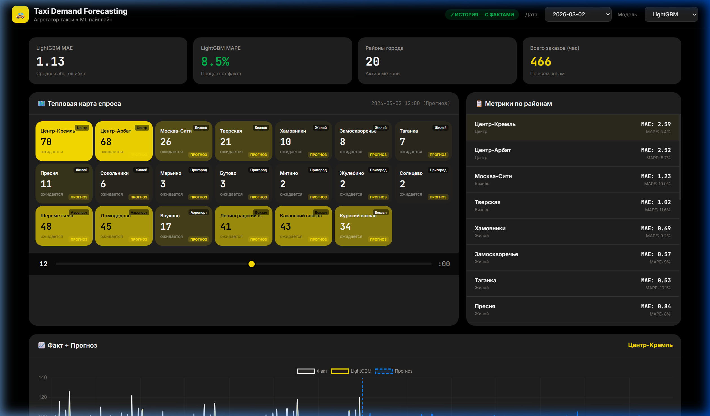
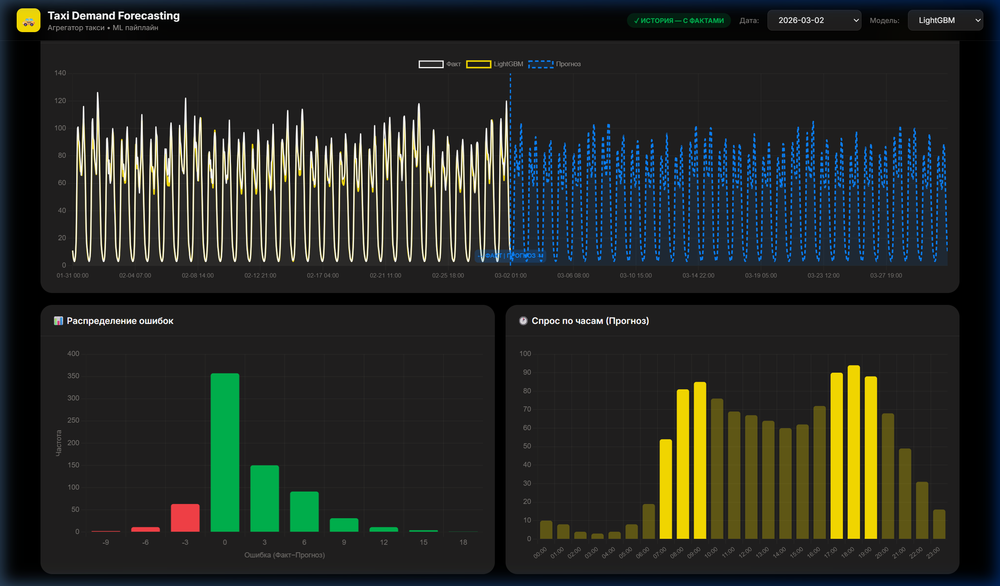

# 🚕 Taxi Demand Forecasting

**Predict hourly taxi demand across 20 city zones** using gradient boosting (LightGBM) with a seasonal baseline comparison. Includes an interactive dark-themed dashboard with historical analysis and 30-day future forecasting.


---

## 📸 Dashboard

### Тепловая карта и метрики


### Графики: Факт vs Прогноз, распределение ошибок, почасовой спрос


---

## 📋 Problem Statement

Given historical taxi demand data across **20 city zones** with weather, holidays, and temporal patterns:
- **Predict** the number of orders per zone for each hour
- **Forecast** up to 30 days into the future using rolling predictions
- **Compare** LightGBM vs. seasonal baseline
- **Visualize** everything on an interactive dashboard

## 📈 Results

| Model | MAE | MAPE |
|-------|-----|------|
| **LightGBM** | **1.13** | **8.5%** |
| Seasonal Baseline | 1.81 | 9.1% |

LightGBM outperforms the hourly seasonal baseline, proving the value of the 45 complex features (lags, weather, momentum).

## 🚀 Quick Start

```bash
# 1. Install dependencies
pip install -r requirements.txt

# 2. Run full pipeline
python data/generate_data.py          # Generate synthetic data (~175k rows)
python src/features.py                # Engineer 45 features
python src/train_lightgbm.py          # Train LightGBM model
python src/evaluate.py                # Compute metrics
python src/forecast_future.py --days 30  # 30-day rolling forecast

# 3. Launch dashboard
python dashboard/app.py
# Open http://localhost:8050
```

## 📊 Feature Engineering (45 features)

| Category | Features |
|----------|----------|
| **Lags** | 1h, 2h, 3h, 6h, 12h, 24h, 48h, 168h |
| **Rolling** | Mean/Std over 3h, 6h, 12h, 24h windows |
| **Cyclical** | sin/cos encoding for hour, day-of-week, month |
| **Flags** | Rush hour, night, weekend, holiday |
| **Weather** | Temperature, precipitation, wind speed, bad weather interaction |
| **Zone** | Mean demand per zone, peak hour, demand ratio |

## 🏗️ Project Structure

```
├── data/
│   └── generate_data.py       # Synthetic data generator (seed=42)
├── src/
│   ├── config.py              # Zones, holidays, paths
│   ├── features.py            # Feature engineering pipeline
│   ├── train_lightgbm.py      # Model training with early stopping
│   ├── evaluate.py            # Metrics calculation (MAE, MAPE)
│   └── forecast_future.py     # Rolling 30-day future forecast
├── dashboard/
│   ├── app.py                 # FastAPI backend (5 API endpoints)
│   └── templates/
│       └── index.html         # Interactive dark-themed UI
├── outputs/evaluation/        # Predictions, metrics, forecasts
├── requirements.txt
└── README.md
```

## 🖥️ Dashboard Features

- **Heatmap** — demand intensity per zone at any hour
- **Time slider** — explore demand by hour of day
- **Time series chart** — fact vs prediction with future forecast boundary
- **Error distribution** — histogram of prediction errors
- **Hourly forecast** — average predicted demand by hour
- **Model selector** — switch between LightGBM only or both models
- **Date picker** — grouped by History (with actuals) and Forecast (future)

---

*Built as a portfolio project demonstrating time-series forecasting, feature engineering, and full-stack ML dashboard development.*
