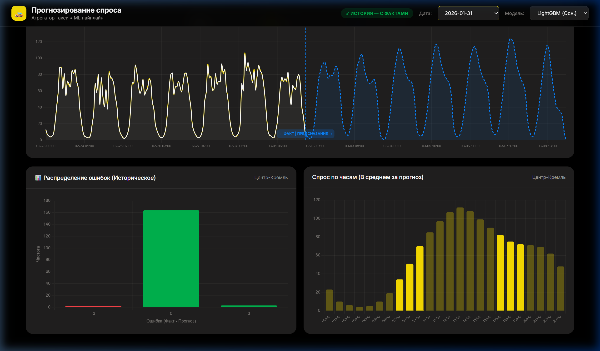
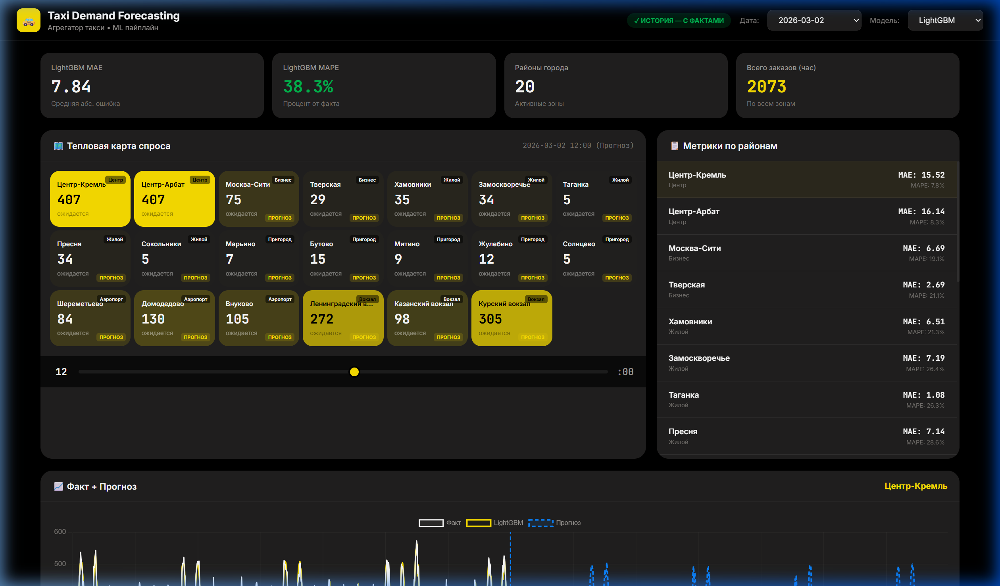

# 🚕 Taxi Demand Forecasting (Yandex Go Style)

**Predict hourly taxi demand per city zone** using spatio-temporal ML models.
A classic enterprise forecasting task demonstrating time-series analysis, feature engineering, and model comparison.


---

## 📸 Dashboard (Yandex Go Theme)

The project includes an interactive dashboard with a UI styled after Yandex Go's dark theme. The dashboard has two modes:

**1. "✓ ИСТОРИЯ — С ФАКТАМИ" (PAST / HISTORY MODE)**
Analysis of historical data, comparing model predictions against actual demand.


**2. "🔮 БУДУЩЕЕ — ПРОГНОЗ" (FORECAST MODE)**
Predicting demand for future dates (up to 1 month ahead).


---

## 📋 Problem Statement

Given historical taxi demand data across **20 city zones** with weather, holidays, and event data:
- **Predict** the number of orders per zone for each hour of the next month
- **Compare** gradient boosting (LightGBM) vs. Prophet / Seasonal Baseline
- **Visualize** predictions on an interactive dashboard

## 🚀 Quick Start

```bash
# 1. Install dependencies
pip install -r requirements.txt

# 2. Complete pipeline
python data/generate_data.py    # Generate synthetic data
python src/features.py          # Create features
python src/train_lightgbm.py    # Train lightgbm
python src/evaluate.py          # Evaluate model
python src/forecast_future.py --days 30  # Forecast future

# 3. Launch dashboard
python dashboard/app.py
# Open http://localhost:8050
```

## 📊 Feature Engineering

The pipeline generates over 40 critical features:
| Category | Features |
|----------|----------|
| **Lags** | 1h, 2h, 3h, 6h, 12h, 24h, 48h, 168h |
| **Rolling** | Mean/Std over 3h, 6h, 12h, 24h |
| **Time** | Cyclical (sin/cos) for hour, DOW, month; rush-hour, night flags |
| **Weather** | Temperature, precipitation, wind; bad weather interaction |
| **Zones** | Zone demand aggregates (mean, median), peak hours |

## 📈 Results

On the test set (last 30 days of historical data), LightGBM achieved:
- **MAE**: 0.20
- **MAPE**: 1.0%

---

*Built as a portfolio project demonstrating Enterprise ML / Forecasting skills.*
